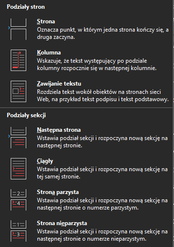
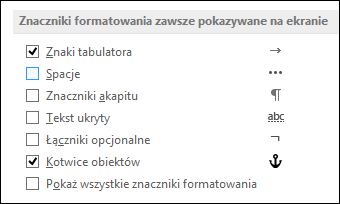

# Dzielenie dokumentu tekstowego

## Powtórzenie
1. Z jakich opcji wstawiania nagłówka i stopki dokumentu naleiy skorzystać, aby różniły
sie one treścią na stronach parzystych i nieparzystych?
2. Jakie jest zastosowanie stylów tekstu?
3. W jaki sposób umieszcza sie spis treści, ilustracji i tabel w dokumencie tekstowym?

## Podział strony

Podział strony wymusza rozpoczęcie tekstu od nowej strony.  
Nie zmienia ustawień dokumentu (marginesów, orientacji, nagłówków).

## Podział sekcji

Podział sekcji umożliwia:

- zmianę orientacji tylko wybranej strony,
- zmianę marginesów w części dokumentu,
- różne nagłówki i stopki,
- inną numerację stron,
- podział tekstu na kolumny tylko w wybranym fragmencie.

W praktyce podział sekcji możemy wykorzystać np. do ustawienia strony z tabelą w poziomie, dla lepszej czytelności.

## Znaki białe
Znaki białe to znaki, które organizują strukturę tekstu, ale nie są widoczne w wydruku.
Można je zobaczyć po włączeniu opcji „Pokaż wszystko” w edytorze tekstu.

Służą do:

- wyznaczania odstępów,
- kończenia akapitów i wierszy,
- kontrolowania łamania tekstu,
- utrzymywania poprawnej struktury dokumentu.

Przykładowe znaki w edyotrze MS Word:

### Rodzaje znaków białych

# Rodzaje znaków białych

Znaki białe (niedrukowane) to elementy organizujące strukturę tekstu.  
Nie są widoczne na wydruku, ale wpływają na układ dokumentu.

---

## 1. Spacja (zwykła)

- Klawisz: `Spacja`
- Oddziela wyrazy.
- Może zostać przeniesiona na koniec wiersza.
- Nie chroni przed podziałem wyrażeń (np. „10 kg” może zostać rozdzielone).

---

## 2. Twarda spacja (niełamliwa)

- Skrót: `Ctrl + Shift + Spacja`
- Zapobiega przeniesieniu wyrazu do nowej linii.
- Stosowana w:
  - liczbach z jednostkami (10 kg),
  - datach (12 maja),
  - inicjałach (J. Kowalski),
  - skrótach (nr 5).

---

## 3. Twardy Enter (koniec akapitu)

- Klawisz: `Enter`
- Kończy akapit.
- Tworzy nową jednostkę strukturalną dokumentu.
- Może wpływać na numerację, style i odstępy.
- W widoku znaków niedrukowanych oznaczony symbolem `¶`.

---

## 4. Miękki Enter (podział wiersza)

- Skrót: `Shift + Enter`
- Przenosi tekst do nowej linii bez tworzenia nowego akapitu.
- Nie zmienia stylu ani numeracji.
- Stosowany np. w adresach, lub przy przenoszeniu sierotek

---

## 5. Tabulator

- Klawisz: `Tab`
- Służy do wyrównywania tekstu.
- Nie powinien być zastępowany wieloma spacjami.

---

## 6. Podział strony

- Wymusza rozpoczęcie tekstu od nowej strony.
- Nie zmienia ustawień formatowania dokumentu.

---

## 7. Podział sekcji

- Dzieli dokument na części o różnych ustawieniach.
- Umożliwia zmianę:
  - orientacji strony,
  - marginesów,
  - nagłówków i stopek,
  - numeracji stron.

## Zadania do wykonania.
1. W pliku `skryba.docx` zastosuj znaki białe dla:
- wzrostu Asterixa
- godzin
- sierotek
- tabulację dla zdania Panoramixa

2. Oddziel dialogi piratów, dla dialogów pirata dodaj tabulację.

3. Podziel dialog Numernabisa i Szczękościska na dwie kolumny (Kolumny -> dwie, następnie znaki podziału -> kolumna)

4. Z pliku `praca.docx` skopiuj wstęp do nowego dokumentu. Podziel go na trzy strony. Na każdej z nich ustaw inne marginesy.

5. W pliku `zestawienie.xlsx` stwórz wykres kolumnowy z danych. Dodaj wykres oraz tabelę do dokumentu, ustawiająco poziomą orientację strony.
